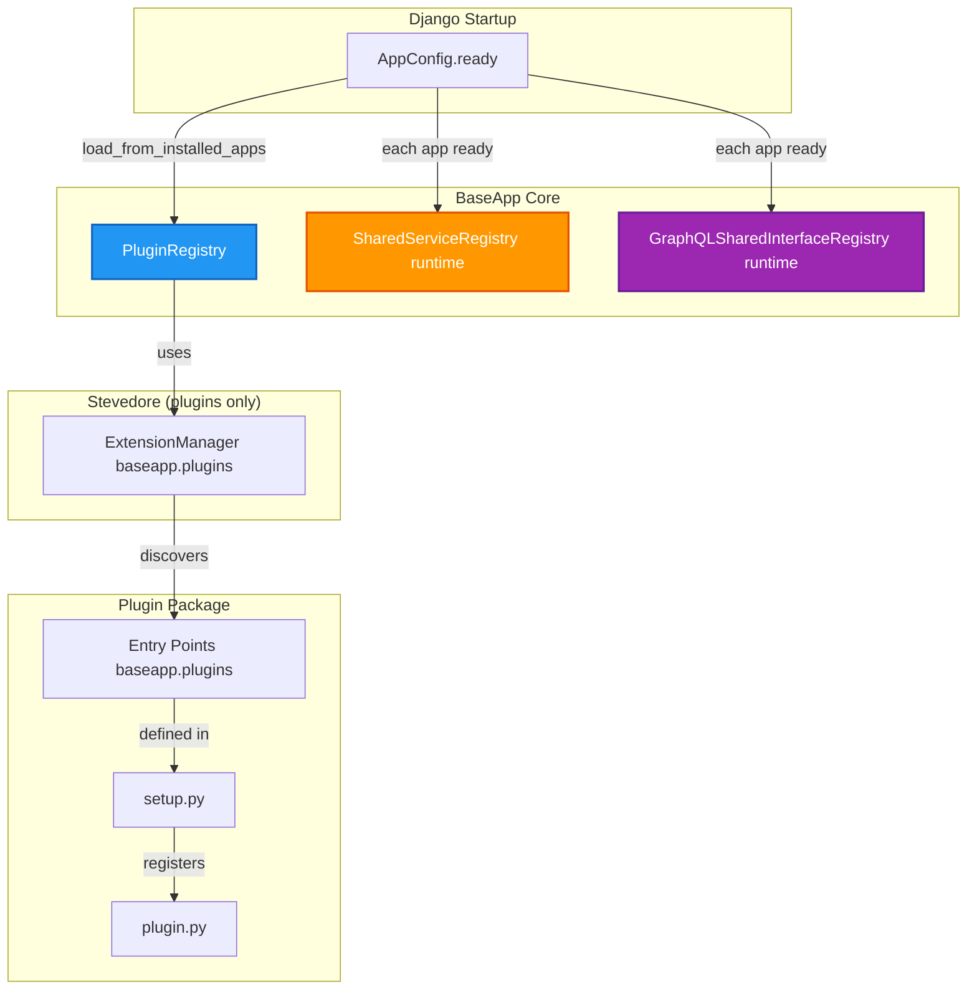
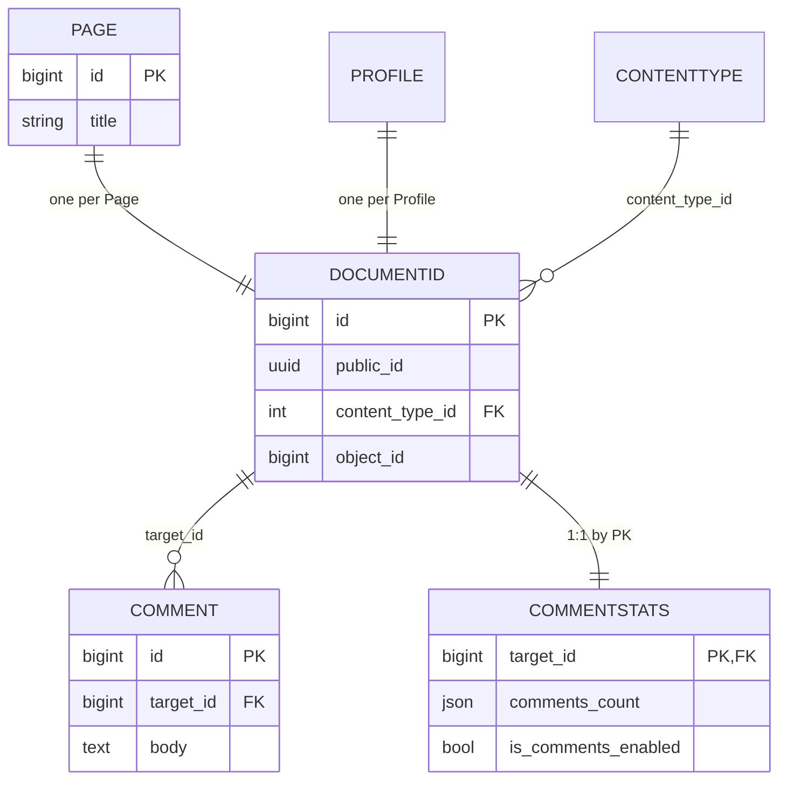

# BaseApp Plugin Architecture Guide

## Table of Contents

1. [Overview](#overview)
2. [Creating a New Plugin Package](#creating-a-new-plugin-package)
3. [Plugin Settings](#plugin-settings)
4. [Database Coupling via DocumentId](#database-coupling-via-documentid)
5. [Communication Patterns](#communication-patterns)
   - [Django Signals (Event-Driven Communication)](#django-signals-event-driven-communication)
   - [Services (Data/Functionality Provision)](#services-datafunctionality-provision)
   - [GraphQL Capabilities (Schema Extension)](#graphql-capabilities-schema-extension)
6. [Runtime Extension Contract: BaseAppConfig](#runtime-extension-contract-baseappconfig)
7. [Complete Example](#complete-example)
8. [Backward Compatibility and Rebase](#backward-compatibility-and-rebase)

---

## Overview

BaseApp uses a **plugin-based architecture** to enable loose coupling between packages. Plugins are discovered via setuptools entry points **for static configuration only**. Runtime behavior (services, GraphQL, event handling) is **explicit and opt-in**, and all runtime wiring happens in `AppConfig.ready()`.

**Rebasing from an older setup?** Backward compatibility is not guaranteed. See [PLUGIN_ARCHITECTURE_BACKWARDS_COMPATIBILITY.md](PLUGIN_ARCHITECTURE_BACKWARDS_COMPATIBILITY.md) for what breaks and how to adapt (database, settings, signals, registries, GraphQL, admin).

### Key Principles

- **Zero Direct Coupling**: Packages don't import from each other for runtime behavior.
- **Plugin Discovery**: Plugins are discovered via setuptools entry point `baseapp.plugins` (for settings aggregation).
- **Runtime Wiring in ready()**: Services and GraphQL capabilities are registered in `AppConfig.ready()`; no entry points for hooks, services, or interfaces.
- **Django-Native**: Cross-package events use **Django signals**; receivers are connected in `ready()`.
- **Database Decoupling**: Packages use `DocumentId` as a communication layer.

### What Stays

- Plugin registry (Stevedore for `baseapp.plugins` only)
- Plugin settings aggregation
- `PackageSettings`
- `required_packages` / `optional_packages`
- `DocumentId` pattern
- Plugin discovery via packaging (entry points for **plugins only**)

### What Changed (from the previous architecture)

- **Hooks** → replaced by **Django signals**
- **Services** → runtime registration via `AppConfig.ready()` (no `baseapp.services` entry points)
- **GraphQL Interfaces** → runtime registration via `AppConfig.ready()` as **GraphQL capabilities** (no `baseapp.interfaces` entry points)

### Architecture Flow



---

## Creating a New Plugin Package

### Step 1: Package Structure

Create a new package following this structure:

```
baseapp_yourpackage/
    __init__.py
    apps.py          # Use BaseAppConfig + mixins; register in ready()
    plugin.py        # Plugin definition (settings only)
    setup.py         # Entry points: baseapp.plugins only
    models.py
    signals.py       # Optional: connect to Django signals
    services.py      # Optional: service provider classes
    graphql/
        interfaces.py  # Optional: capability getters
        object_types.py
        queries.py
        mutations.py
```

### Step 2: Create `setup.py`

Only **plugin registration** uses entry points. Do **not** register hooks, services, or GraphQL interfaces here.

```python
from setuptools import find_packages, setup

setup(
    name="baseapp_yourpackage",
    version="1.0",
    packages=find_packages(),
    entry_points={
        "baseapp.plugins": [
            "baseapp_yourpackage = baseapp_yourpackage.plugin:YourPackagePlugin",
        ],
    },
    zip_safe=False,
)
```

### Step 3: Create `plugin.py`

The plugin class defines **static** package settings and configuration (no runtime behavior). Use Django-style aliases (e.g. `INSTALLED_APPS`) or field names; slotted fields use a **dict of slot name → list**.

```python
from baseapp_core.plugins.base import BaseAppPlugin, PackageSettings


class YourPackagePlugin(BaseAppPlugin):
    @property
    def name(self) -> str:
        return "baseapp_yourpackage"

    @property
    def package_name(self) -> str:
        return "baseapp_yourpackage"

    def get_settings(self) -> PackageSettings:
        return PackageSettings(
            INSTALLED_APPS=["baseapp_yourpackage"],
            MIDDLEWARE={"default": ["baseapp_yourpackage.middleware.YourMiddleware"]},
            AUTHENTICATION_BACKENDS={
                "baseapp_yourpackage": [
                    "baseapp_yourpackage.permissions.YourPackagePermissionsBackend",
                ],
            },
            GRAPHENE__MIDDLEWARE={"default": ["baseapp_yourpackage.graphql.middleware.YourMiddleware"]},
            django_extra_settings={
                "BASEAPP_YOURPACKAGE_SETTING": "value",
            },
            required_packages=["baseapp_core"],
            optional_packages=["baseapp_notifications"],
            graphql_queries=["baseapp_yourpackage.graphql.queries.YourPackageQueries"],
            graphql_mutations=["baseapp_yourpackage.graphql.mutations.YourPackageMutations"],
            graphql_subscriptions=[],
        )
```

### Step 4: Register in `requirements.txt`

For Stevedore to discover your plugin, the package must be installed via pip. Add it to your project's `requirements.txt`:

```txt
-e ./baseapp_yourpackage
```

### Step 5: Add to `INSTALLED_APPS`

Add your package to Django's `INSTALLED_APPS` in your project's `settings.py`:

```python
INSTALLED_APPS = [
    # ... other apps
    "baseapp_yourpackage",
]
```

---

## Plugin Settings

The `PackageSettings` model (Pydantic) defines what each plugin contributes. Only plugins whose app is in `INSTALLED_APPS` are loaded; if an app is disabled, none of its contributions are included.

### PackageSettings fields (overview)

| Category | Field (alias) | Type | Description |
|----------|---------------|------|-------------|
| List | `installed_apps` (`INSTALLED_APPS`) | `List[str]` | Apps to add; aggregated from all plugins. |
| Slotted | `authentication_backends` (`AUTHENTICATION_BACKENDS`) | `Dict[str, List[str]]` | Slot name → list of backend paths. |
| Slotted | `middleware` (`MIDDLEWARE`) | `Dict[str, List[str]]` | Slot name → list of middleware paths. |
| Slotted | `graphene_middleware` (`GRAPHENE__MIDDLEWARE`) | `Dict[str, List[str]]` | Slot name → list for `GRAPHENE["MIDDLEWARE"]`. |
| Dict | `django_extra_settings` | `Dict[str, Any]` | Merged into Django settings (and env-style docs). |
| Dict | `celery_beat_schedules`, `celery_task_routes`, `constance_config` | `Dict` | Merged; last plugin wins on key conflict. |
| List | `urlpatterns`, `graphql_queries`, `graphql_mutations`, `graphql_subscriptions` | `List` | Aggregated. |
| Deps | `required_packages`, `optional_packages` | `List[str]` | Validation only. |

**Slotted fields** use a dict: keys are slot names (e.g. `"auth"`, `"profile"`, `"baseapp_comments"`), values are lists of paths. The project chooses order by calling `get(key, slot)` for each slot in the desired order.

### Registry API: `plugin_registry.get(key)` and `get(key, slot)`

In your project `settings.py`, use **`get(key)`** for aggregated lists and **`get(key, slot)`** when order matters.

- **`plugin_registry.get("INSTALLED_APPS")`** — aggregated list from all enabled plugins. Disabled app → not included.
- **`plugin_registry.get("MIDDLEWARE")`** — all middleware from all plugins (flat). Use when order does not matter.
- **`plugin_registry.get("MIDDLEWARE", "baseapp_auth")`** — only entries under slot `"auth"`. Use to fix order: e.g. `*plugin_registry.get("MIDDLEWARE", "auth")`, then `*plugin_registry.get("MIDDLEWARE", "profile")`. Missing slot or disabled plugin → `[]`.
- **`plugin_registry.get("GRAPHENE__MIDDLEWARE", "baseapp_profiles")`** — slot for Graphene middleware (maps to `GRAPHENE["MIDDLEWARE"]`).

**Supported keys:** `INSTALLED_APPS`, `MIDDLEWARE`, `AUTHENTICATION_BACKENDS`, `GRAPHENE__MIDDLEWARE`, `urlpatterns`, `graphql_queries`, `graphql_mutations`, `graphql_subscriptions`.

**Example in settings.py:**

```python
INSTALLED_APPS += [
    # ...
    *plugin_registry.get("INSTALLED_APPS"),
    "testproject.testapp",
]

MIDDLEWARE += [
    "baseapp_profiles.middleware.CurrentProfileMiddleware",
    "baseapp_core.middleware.HistoryMiddleware",
    *WAGTAIL_MIDDLEWARE,
    *plugin_registry.get("MIDDLEWARE", "baseapp_auth"),
    *plugin_registry.get("MIDDLEWARE", "baseapp_profiles"),
]

GRAPHENE["MIDDLEWARE"] = (
    "baseapp_profiles.graphql.middleware.CurrentProfileMiddleware",
    *plugin_registry.get("GRAPHENE__MIDDLEWARE", "baseapp_profiles"),
) + GRAPHENE["MIDDLEWARE"]

AUTHENTICATION_BACKENDS = [
    "django.contrib.auth.backends.ModelBackend",
    *plugin_registry.get("AUTHENTICATION_BACKENDS", "baseapp_auth"),
    *plugin_registry.get("AUTHENTICATION_BACKENDS", "baseapp_profiles"),
    *plugin_registry.get("AUTHENTICATION_BACKENDS", "baseapp_comments"),
    # ...
]
```

### URL patterns (`urlpatterns` and `v1_urlpatterns`)

Plugins contribute URL patterns via **callbacks** (callables) so the registry can resolve them without importing views at import time. Each callback receives `include`, `path`, and `re_path` and returns a **list** of `path()` / `re_path()` instances (and thus `URLResolver` from `include()`).

| Contribution   | Registry getter                     | Typical use in project |
|----------------|-------------------------------------|-------------------------|
| `urlpatterns`  | `plugin_registry.get_all_urlpatterns()`   | Root-level URL includes (e.g. auth, admin-related). |
| `v1_urlpatterns` | `plugin_registry.get_all_v1_urlpatterns()` | Patterns under the `/v1/` API namespace. |

**Plugin side (callback mode):** In `plugin.py`, set `urlpatterns` and/or `v1_urlpatterns` to a function with signature `(include, path, re_path) -> List[path | re_path]`. Return a list of URL pattern instances; the registry flattens all plugins’ lists.

```python
# plugin.py
def get_settings(self) -> PackageSettings:
    def v1_urlpatterns(include, path, re_path):
        return [
            re_path(r"auth/authtoken/", include("baseapp_auth.rest_framework.urls.auth_authtoken")),
            re_path(r"auth/jwt/", include("baseapp_auth.rest_framework.urls.auth_jwt")),
            # ...
        ]
    return PackageSettings(
        v1_urlpatterns=v1_urlpatterns,
        # ...
    )
```

**Project side:** In the project’s `urls.py`, use the registry getters so all enabled plugins’ URLs are included. Do not import or include plugin URL modules directly.

```python
# urls.py
from baseapp_core.plugins import plugin_registry

v1_urlpatterns = [
    path(r"", include("baseapp_url_shortening.urls")),
    *plugin_registry.get_all_v1_urlpatterns(),
]

urlpatterns = [
    path("admin/", admin.site.urls),
    path("v1/", include((v1_urlpatterns, "v1"), namespace="v1")),
    *plugin_registry.get_all_urlpatterns(),
]
```

Only plugins whose app is in `INSTALLED_APPS` contribute; if a plugin is disabled, its URL patterns are omitted.

### GraphQL schema (root `graphql.py`)

The project’s **root GraphQL schema** (e.g. `testproject/graphql.py`) must **not** import Query, Mutation, or Subscription mixins from BaseApp packages. All plugin-contributed schema is aggregated via the registry.

- **Use only:** `plugin_registry.get_all_graphql_queries()`, `plugin_registry.get_all_graphql_mutations()`, `plugin_registry.get_all_graphql_subscriptions()`.
- **Project-specific mixins** (e.g. `UsersQueries` from the project’s own app) may be inherited explicitly alongside the registry results.
- **Plugins** contribute `graphql_queries`, `graphql_mutations`, `graphql_subscriptions` in `plugin.py` as lists of class paths (or class references); the registry resolves and aggregates them. Only plugins whose app is in `INSTALLED_APPS` contribute.

**Root graphql.py pattern:**

```python
# graphql.py — no baseapp_* app imports for schema mixins
import graphene
from baseapp_core.graphql import DeleteNode, Node as RelayNode
from baseapp_core.plugins import plugin_registry
from graphene.relay.node import NodeField as RelayNodeField
from graphene_django.debug import DjangoDebug

from myproject.users.graphql.queries import UsersQueries  # project-specific only

queries = plugin_registry.get_all_graphql_queries()
mutations = plugin_registry.get_all_graphql_mutations()
subscriptions = plugin_registry.get_all_graphql_subscriptions()

class Query(graphene.ObjectType, UsersQueries, *queries):
    node = RelayNodeField(RelayNode)
    debug = graphene.Field(DjangoDebug, name="_debug")

class Mutation(graphene.ObjectType, *mutations):
    delete_node = DeleteNode.Field()

class Subscription(graphene.ObjectType, *subscriptions):
    pass

schema = graphene.Schema(query=Query, mutation=Mutation, subscription=Subscription)
```

If a BaseApp package’s queries/mutations/subscriptions are not in the schema, ensure that package has a plugin and contributes `graphql_queries` / `graphql_mutations` / `graphql_subscriptions` in its `plugin.py`.

**Dict settings** (merged, not via `get`): use `plugin_registry.get_all_django_extra_settings()` and apply to `globals()` or `settings`, and `get_all_constance_config()` for Constance.

### Example plugin: slotted contributions (baseapp_comments)

```python
# baseapp_comments/plugin.py
return PackageSettings(
    INSTALLED_APPS=["baseapp_comments"],
    AUTHENTICATION_BACKENDS={
        "baseapp_comments": [
            "baseapp_comments.permissions.CommentsPermissionsBackend",
        ],
    },
    django_extra_settings={
        "BASEAPP_COMMENTS_CAN_ANONYMOUS_VIEW_COMMENTS": True,
        "BASEAPP_COMMENTS_ENABLE_GRAPHQL_SUBSCRIPTIONS": True,
        # env-style docs can live here too
        "BASEAPP_COMMENTS_ENABLE_NOTIFICATIONS": {"default": True, "type": bool, "description": "..."},
    },
    required_packages=["baseapp_core"],
    optional_packages=["baseapp_notifications"],
    graphql_queries=["baseapp_comments.graphql.queries.CommentsQueries"],
    graphql_mutations=["baseapp_comments.graphql.mutations.CommentsMutations"],
    graphql_subscriptions=["baseapp_comments.graphql.subscriptions.CommentsSubscriptions"],
)
```

Convenience methods `get_all_installed_apps()`, `get_all_middleware()`, `get_all_auth_backends()`, `get_all_graphene_middleware()`, `get_all_django_extra_settings()`, etc. remain and delegate to `get()` or the merge helpers where applicable.

---

## Database Coupling via DocumentId

### The Problem

Traditional Django apps often create direct foreign key relationships between models in different packages, creating tight coupling. If you remove a package, migrations break and the system becomes fragile.

### The Solution: DocumentId Pattern

`DocumentId` is a central table that provides a unique identifier for any object in the system. Instead of packages creating direct relationships, they create **auxiliary tables** that reference `DocumentId`.

### How It Works



### DocumentId Model

```python
# baseapp_core/models.py
class DocumentId(TimeStampedModel):
    """
    Centralized document registry for all entities in the system.
    Part of the DocumentId pattern for plugin architecture.
    """
    public_id = models.UUIDField(default=uuid.uuid4, editable=False)
    content_type = models.ForeignKey(ContentType, on_delete=models.CASCADE)
    object_id = models.PositiveBigIntegerField()
    content_object = GenericForeignKey("content_type", "object_id")

    class Meta:
        unique_together = ("content_type", "object_id")
        indexes = [models.Index(fields=["public_id"])]
```

Helpers: `DocumentId.get_or_create_for_object(obj)`, `get_public_id_from_object(obj)`, `get_object_by_public_id(public_id)`.

### Creating DocumentId for Your Models

**Preferred: use `DocumentIdMixin` and pgtrigger.** Models that need a document ID should inherit from `baseapp_core.models.DocumentIdMixin`. On `class_prepared`, the core adds pgtrigger-based `insert_document_id` / `delete_document_id` triggers, so a `DocumentId` row is created or removed automatically when the row is inserted or deleted. No Python signal is required for that.

```python
# baseapp_core/graphql/models.py (RelayModel uses it)
class RelayModel(DocumentIdMixin, models.Model):
    ...
```

**Python path:** When you need the `DocumentId` from Python (e.g. to create or link auxiliary rows), use `DocumentId.get_or_create_for_object(instance)`. If the row is created there, the `document_created` signal is sent so other apps can react (e.g. create their stats row).

**Fallback (no mixin):** If a model does not use `DocumentIdMixin`, you can ensure a `DocumentId` exists via a `post_save` signal calling `DocumentId.get_or_create_for_object(instance)` when `created` is True.

### Creating Auxiliary Tables

Packages create their own tables that reference `DocumentId` (not the other package’s model). That keeps coupling at the central table only.

```python
# baseapp_comments/models.py (pattern; actual implementation may use swapper)
from baseapp_core.models import DocumentId

class CommentStats(models.Model):
    target = models.OneToOneField(
        DocumentId,
        on_delete=models.CASCADE,
        primary_key=True,
        related_name="comment_stats",
    )
    comments_count = models.JSONField(default=default_comments_count)
    is_comments_enabled = models.BooleanField(default=True)
```

Comments then reference the commentable via `DocumentId` (e.g. `target_content_type` / `target_object_id` or a `target_id` pointing to `DocumentId`), so any model that has a `DocumentId` can be commentable without a direct FK from your package to theirs.

### Benefits

- **Zero Direct Coupling**: Packages don't modify each other's models.
- **Easy Removal**: Remove a package = remove its tables; no FKs from other packages into yours.
- **Flexible Relationships**: Any model with a `DocumentId` can have comments, reactions, etc.
- **Centralized Identity**: One ID system (`DocumentId` + `public_id`) for all entities.

---

## Communication Patterns

BaseApp provides three communication patterns:

1. **Django Signals**: Event-driven communication (replaces the old hooks).
2. **Services**: Data/functionality provision via a **runtime** registry (no entry points).
3. **GraphQL Capabilities**: Named interfaces registered at runtime; consumers opt in by name.

### Decision Matrix

| Need | Pattern | Use When |
|------|---------|----------|
| React to events | **Django signals** | Multiple packages need to respond to the same event |
| Provide/consume data | **Services** | Package needs to expose functionality to others |
| Extend GraphQL schema | **GraphQL capabilities** | Package needs to add fields/types to GraphQL |

---

## Django Signals (Event-Driven Communication)

### Overview

Cross-package events use **Django signals**. Signals are defined in shared or core modules; receivers are connected in `AppConfig.ready()`.

### Properties

- **Runtime-only**: No entry points; no Stevedore for events.
- **Order-independent**: Receivers can be connected in any `ready()` order.
- **Zero coupling**: Producers send signals; consumers connect in their app. No producer knowledge of consumers.
- **Django-native**: Debuggable and well-understood.

### Core Signal: document_created

When a new `DocumentId` row is created (e.g. via `DocumentId.get_or_create_for_object()` or `DocumentId` `post_save`), the signal `baseapp_core.signals.document_created` is sent with `document_id=<pk>`.

**Connect in your app's ready():**

```python
# myapp/apps.py
from baseapp_core.signals import document_created

def _on_document_created(sender, document_id, **kwargs):
    # Create stats for the new document, etc.
    ...

class PackageConfig(BaseAppConfig, ...):
    def ready(self):
        super().ready()
        document_created.connect(_on_document_created, dispatch_uid="my_app_on_document_created")
```

### Defining Your Own Signals

Define signals in your app (e.g. in `signals.py` or a dedicated module) and send them from your code. Other apps connect in their `ready()`.

```python
# myapp/signals.py
from django.dispatch import Signal

comment_created = Signal()  # kwargs: comment_id, target_document_id
comment_deleted = Signal()  # kwargs: comment_id, target_document_id
```

---

## Services (Data/Functionality Provision)

### Overview

Services ("shared services") are registered **at runtime** in `AppConfig.ready()`. No entry points are used. The runtime registry is `shared_service_registry`; consumers resolve services via `shared_service_registry.get_service(name)`.

### Pattern

- **Provider**: Implements `ServiceProvider` (`.service_name`, `.is_available()`) and registers in `register_shared_services()`.
- **Consumer**: Calls `shared_service_registry.get_service("service_name")` and handles `None` (missing or unavailable).
- **No direct imports** between apps for runtime behavior.

### Step 1: Create a Service

```python
# baseapp_comments/services.py
from django.apps import apps
from baseapp_core.models import DocumentId
from baseapp_core.services.registry import ServiceProvider

from .models import CommentStats

class CommentsCountService(ServiceProvider):
    @property
    def service_name(self) -> str:
        return "comments_count"

    def is_available(self) -> bool:
        return apps.is_installed("baseapp_comments")

    def get_count(self, document_id: int) -> dict:
        ...
    def is_enabled(self, document_id: int) -> bool:
        ...
```

### Step 2: Register in AppConfig.ready()

Use the `ServicesContributor` mixin and override `register_shared_services()`:

```python
# baseapp_comments/apps.py
from baseapp_core.app_config import BaseAppConfig, ServicesContributor

class PackageConfig(BaseAppConfig, ServicesContributor, ...):
    def register_shared_services(self, registry):
        from .services import CommentsCountService
        registry.register("comments_count", CommentsCountService())
```

### Step 3: Consume the Service

```python
# consumer/graphql/object_types.py
from baseapp_core.services import shared_service_registry

# In a resolver:
service = shared_service_registry.get_service("comments_count")
if service:
    return service.get_count(document_id)
return None
```

---

## GraphQL Capabilities (Schema Extension)

### Overview

GraphQL "shared interfaces" are **named, reusable** Graphene interfaces. Providers register them in `AppConfig.ready()` with `graphql_shared_interface_registry`; consumers **explicitly opt in by name** when defining their GraphQL object types. To keep things **pluggable**, consumers must **not** import interface classes from other packages — they request interfaces by **name** via the registry. Missing names are skipped; no error.

### Pattern

- **Provider**: Registers a capability (e.g. `"comments"`, `"permissions"` → interface class or callable) in `register_graphql_shared_interfaces()`.
- **Consumer**: Calls `graphql_shared_interface_registry.get_interfaces(["comments", "permissions"], default_interfaces)` and uses the result as `Meta.interfaces`. Only the **core** package and the current package’s own interfaces should appear in `default_interfaces`; optional/pluggable interfaces are requested by name so that if the provider app is not installed, they are simply omitted.
- **Missing capabilities**: Skipped gracefully; no error.

### Step 1: Create an Interface

```python
# baseapp_comments/graphql/object_types.py
class CommentsInterface(RelayNode):
    comments_count = graphene.Field(CommentsCount, required=True)  # or custom type
    is_comments_enabled = graphene.Boolean(required=True)
    # ... resolvers using shared_service_registry.get_service("comments_count")
```

### Step 2: Register in AppConfig.ready()

Use the `GraphQLContributor` mixin and override `register_graphql_shared_interfaces()`:

```python
# baseapp_comments/apps.py
from baseapp_core.app_config import BaseAppConfig, GraphQLContributor
from baseapp_core.graphql import graphql_shared_interface_registry

class PackageConfig(BaseAppConfig, GraphQLContributor, ...):
    def register_graphql_shared_interfaces(self):
        from .graphql.object_types import CommentsInterface
        graphql_shared_interface_registry.register("comments", CommentsInterface)
```

You can register the interface class directly or a callable that returns it (e.g. for lazy loading).

### Step 3: Consumer Opts In by Name (no cross-package imports)

Consumers must **not** import interface classes from other BaseApp packages. Request pluggable interfaces by **name** so the registry can resolve them at runtime; if the provider is not installed, that interface is omitted.

```python
# baseapp_pages/graphql/object_types.py
from baseapp_core.graphql import graphql_shared_interface_registry, RelayNode

def _get_page_interfaces():
    return graphql_shared_interface_registry.get_interfaces(
        ["comments", "permissions"],  # Pluggable: by name only; no import of baseapp_auth / baseapp_comments
        [RelayNode, PageInterface],    # Default interfaces (core + this package only)
    )

class PageObjectType(DjangoObjectType):
    class Meta:
        interfaces = _get_page_interfaces()
        model = Page
```

---

## Runtime Extension Contract: BaseAppConfig

`baseapp_core` defines `BaseAppConfig` and two optional mixins. All runtime extensibility goes through this contract.

### BaseAppConfig

- Subclasses `django.apps.AppConfig`.
- In `ready()`, calls `register_shared_services()` if the app uses `ServicesContributor`, and `register_graphql_shared_interfaces()` if it uses `GraphQLContributor`.
- Subclasses should call `super().ready()` and then perform their own setup (e.g. connecting signals, importing signals module).

### ServicesContributor

- Mixin: implement `register_shared_services()` and call `shared_service_registry.register(name, instance)` for each service.

### GraphQLContributor

- Mixin: implement `register_graphql_shared_interfaces()` and call `graphql_shared_interface_registry.register(name, interface_or_callable)` for each capability.

Apps with no services or GraphQL capabilities may omit the mixins or leave the methods empty.

---

## Complete Example

A minimal plugin that provides settings and exposes a shared service and a GraphQL shared interface:

1. **setup.py**: Only `baseapp.plugins` entry point.
2. **plugin.py**: `BaseAppPlugin` with `get_settings()`.
3. **apps.py**: `BaseAppConfig`, `ServicesContributor`, `GraphQLContributor`; in `ready()` call `super().ready()` and optionally connect to `document_created` or import signals; in `register_shared_services()` and `register_graphql_shared_interfaces()` register the service and capability.
4. **signals.py**: Define and send any app-specific signals (e.g. `comment_created`, `comment_deleted`); optionally connect to `document_created` in `ready()`.
5. **services.py**: Service class implementing `ServiceProvider`.
6. **graphql/object_types.py**: Interface with resolvers using `shared_service_registry.get_service(...)`.
7. **graphql/interfaces.py**: Optional getter that returns the interface class (or register the class directly in apps).

Consumers: resolve services via `shared_service_registry.get_service(...)` and opt in to capabilities via `graphql_shared_interface_registry.get_interfaces([...], default_interfaces)`.

---

## Summary

- **Plugin registry**: Entry point `baseapp.plugins` only. Settings are **`PackageSettings`** (Pydantic) with Django-style aliases and **slotted** fields (`MIDDLEWARE`, `AUTHENTICATION_BACKENDS`, `GRAPHENE__MIDDLEWARE`) as `Dict[slot_name, List[str]]`.
- **Registry API**: Use **`plugin_registry.get("INSTALLED_APPS")`**, **`plugin_registry.get("MIDDLEWARE", "auth")`**, etc. Disabled app → no contribution. Use `get_all_django_extra_settings()` and `get_all_constance_config()` for merged dicts.
- **URLs**: Use **`plugin_registry.get_all_urlpatterns()`** and **`plugin_registry.get_all_v1_urlpatterns()`** in the project’s `urls.py`; plugins contribute via callbacks in `plugin.py`. No direct baseapp URL includes in the project.
- **GraphQL schema**: Root `graphql.py` must **not** import Query/Mutation/Subscription mixins from BaseApp packages. Use **`plugin_registry.get_all_graphql_queries()`**, **`get_all_graphql_mutations()`**, **`get_all_graphql_subscriptions()`**; add project-specific mixins only. Plugins contribute `graphql_queries` / `graphql_mutations` / `graphql_subscriptions` in `plugin.py`.
- **GraphQL shared interfaces**: Runtime registry **`graphql_shared_interface_registry`**; register in `ready()` via `GraphQLContributor.register_graphql_shared_interfaces()`. Consumers opt in **by name** with `graphql_shared_interface_registry.get_interfaces(names, default_interfaces)` — no cross-package interface imports for pluggability.
- **Events**: Django signals; connect in `AppConfig.ready()`.
- **Services**: Runtime registry `shared_service_registry`; register in `ready()` via `ServicesContributor.register_shared_services()`; consume via `shared_service_registry.get_service(name)`.
- **Single integration point**: Each app’s `AppConfig` (and its `ready()`) is where runtime behavior is registered and wired.

---

## Backward Compatibility and Rebase

We do **not** guarantee backward compatibility when moving to this architecture. For a detailed rebase plan — what breaks (database, settings, signals, registries, GraphQL, admin) and how to adapt — see **[PLUGIN_ARCHITECTURE_BACKWARDS_COMPATIBILITY.md](PLUGIN_ARCHITECTURE_BACKWARDS_COMPATIBILITY.md)**.
