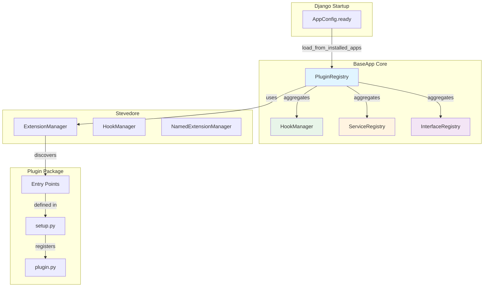
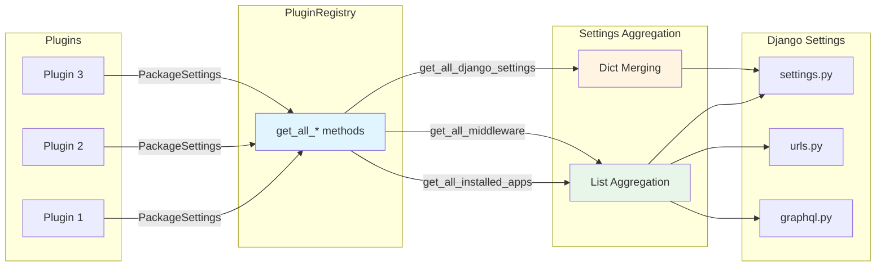
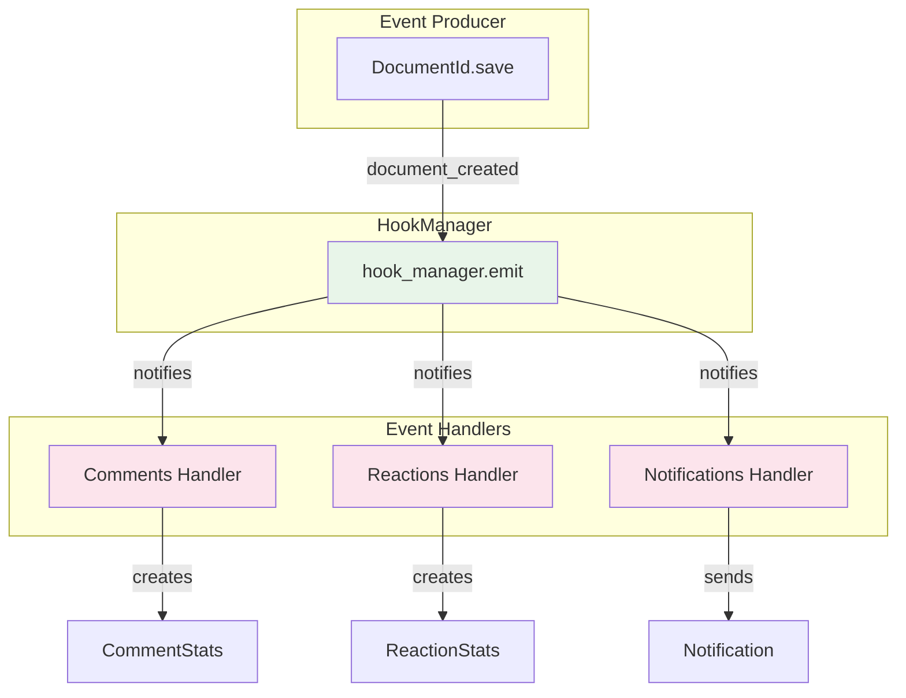
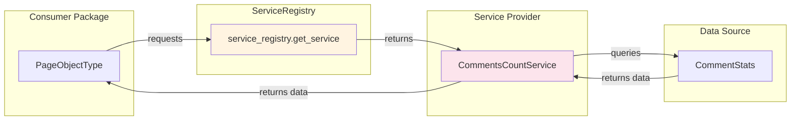
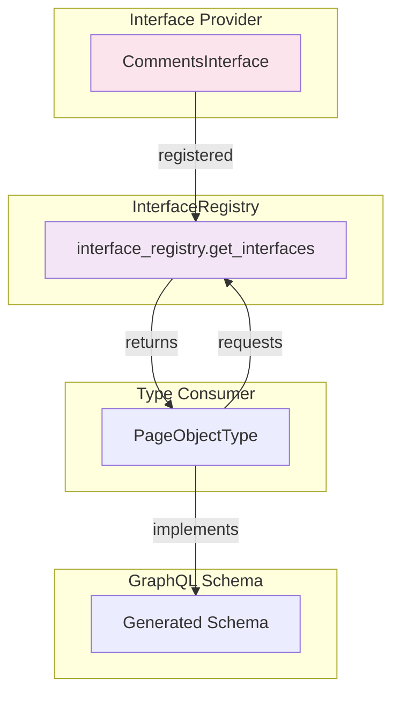
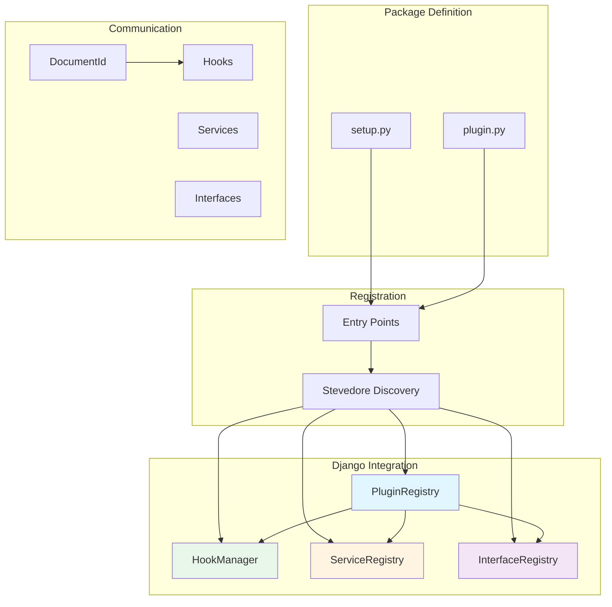

# BaseApp Plugin Architecture Guide

## Table of Contents

1. [Overview](#overview)
2. [Creating a New Plugin Package](#creating-a-new-plugin-package)
3. [Plugin Settings](#plugin-settings)
4. [Database Coupling via DocumentId](#database-coupling-via-documentid)
5. [Communication Patterns](#communication-patterns)
   - [Hooks (Event-Driven Communication)](#hooks-event-driven-communication)
   - [Services (Data/Functionality Provision)](#services-datafunctionality-provision)
   - [GraphQL Interfaces (Schema Extension)](#graphql-interfaces-schema-extension)
6. [Complete Example](#complete-example)

---

## Overview

BaseApp uses a **plugin-based architecture** powered by [Stevedore](https://docs.openstack.org/stevedore/latest/) to enable loose coupling between packages. This allows packages to be easily added or removed from the system without breaking dependencies or requiring manual code changes.

### Key Principles

- **Zero Direct Coupling**: Packages don't import from each other
- **Automatic Discovery**: Plugins are discovered via setuptools entry points
- **Database Decoupling**: Packages use `DocumentId` as a communication layer
- **Three Communication Patterns**: Hooks, Services, and GraphQL Interfaces

### Architecture Flow ([Marmaid Playground](https://mermaidchart.com/play?utm_source=mermaid_live_editor&utm_medium=share#pako:eNp1lFGPojAQx78K6b26BlAUeLjEdUn0wU0D93R4MT07xZ7QklLMerrf_Qqshj2XeWrnN_-ZaQd6QXtJAYUoU6Q8WD-et8IyVtW_O8cWvfwhIpNWoonSdblFXUBji2W6KMulFIxnYwWEnn91EATtFg_JnkkFRmMtpYJ-KhynOK8zLmLIeKXVLVNjqzhdSXncEEEyUD2QxGkC6sT38IVqHadroUEx8oCH20s0nID-11u0SaM3DaLiUjw2sdoMdPdqdK-kADogHu6iuwkLk_3RxPdbSXBagZnCuOwfFeO0bCWf3RFOI2FObWHJha6-LrtYWk9P36-5JHTHlCx2XFSa5DnQHSnL6mom0wXiuA2sKzDOaNM5o03rpLzayxOohuAPgjsCjAugFhdX03yHkg6pdiitCON-Sx-VSJaZEKKbeqt4ECXDaB1_umB9zqEJYzzPw2_gMI-xPlrdkc88CPoouSHG2BScPlrf0QQ85qGR-ZM4RaFWNYxQAaogzRZdGtEW6QMUZqShWVKijs1w342mJOKnlMVNpmSdHVDISF6ZXV1Sc6AXTswHUty9ykwS1FLWQqNwMvXaJCi8oDcUuq47duYz255N3Jnvu74_QmcUOu5s7E8DN_DtYG47XhC8j9Dftq49nk8Cx53OZ-7UDmbGRggo11JtuvehfSbe_wHaT0g_))



---

## Creating a New Plugin Package

### Step 1: Package Structure

Create a new package following this structure:

```
baseapp_yourpackage/
    __init__.py
    apps.py
    plugin.py          # Plugin definition
    setup.py           # Entry points registration
    models.py
    hooks.py           # Optional: event handlers
    services.py        # Optional: service providers
    graphql/
        interfaces.py  # Optional: GraphQL interfaces
        object_types.py
        queries.py
        mutations.py
```

### Step 2: Create `setup.py`

The `setup.py` file is **critical** - it registers your plugin and all its entry points with Stevedore:

```python
from setuptools import find_packages, setup

setup(
    name="baseapp_yourpackage",
    version="1.0",
    packages=find_packages(),
    entry_points={
        # Plugin registration (required)
        "baseapp.plugins": [
            "baseapp_yourpackage = baseapp_yourpackage.plugin:YourPackagePlugin",
        ],
        # Hooks (optional - for event handlers)
        "baseapp.hooks": [
            "document_created.yourpackage = baseapp_yourpackage.hooks:handle_document_created",
        ],
        # Services (optional - for data/functionality provision)
        "baseapp.services": [
            "your_service = baseapp_yourpackage.services:YourService",
        ],
        # GraphQL Interfaces (optional - for schema extension)
        "baseapp.interfaces": [
            "yourpackage = baseapp_yourpackage.graphql.interfaces:get_your_interface",
        ],
    },
    zip_safe=False,
)
```

### Step 3: Create `plugin.py`

The plugin class defines all package settings and configuration:

```python
from baseapp_core.plugins.base import BaseAppPlugin, PackageSettings


class YourPackagePlugin(BaseAppPlugin):
    @property
    def name(self) -> str:
        return "baseapp_yourpackage"

    @property
    def package_name(self) -> str:
        return "baseapp_yourpackage"

    def get_settings(self) -> PackageSettings:
        return PackageSettings(
            installed_apps=[
                "baseapp_yourpackage",
            ],
            middleware=[],
            authentication_backends=[
                "baseapp_yourpackage.permissions.YourPackagePermissionsBackend",
            ],
            graphql_middleware=[],
            env_vars={
                "BASEAPP_YOURPACKAGE_ENABLE_FEATURE": {
                    "default": True,
                    "required": False,
                    "type": bool,
                    "description": "Enable feature X",
                },
            },
            django_settings={
                "BASEAPP_YOURPACKAGE_SETTING": "value",
            },
            celery_beat_schedules={},
            celery_task_routes={},
            constance_config={},
            urlpatterns=[],
            graphql_queries=[
                "baseapp_yourpackage.graphql.queries.YourPackageQueries",
            ],
            graphql_mutations=[
                "baseapp_yourpackage.graphql.mutations.YourPackageMutations",
            ],
            graphql_subscriptions=[],
            required_packages=[
                "baseapp_core",
            ],
            optional_packages=[
                "baseapp_notifications",
            ],
        )
```

### Step 4: Register in `requirements.txt`

**Important**: For Stevedore to discover your plugin's entry points, the package must be installed via `pip`. Add it to your project's `requirements.txt`:

```txt
-e ./baseapp_yourpackage
```

The `-e` flag installs the package in editable mode, allowing setuptools to read the `setup.py` file and register entry points.

### Step 5: Add to `INSTALLED_APPS`

Add your package to Django's `INSTALLED_APPS` in your project's `settings.py`:

```python
INSTALLED_APPS = [
    # ... other apps
    "baseapp_yourpackage",
]
```

### Plugin Discovery Flow ([Marmaid Playground](https://mermaidchart.com/play?utm_source=mermaid_live_editor&utm_medium=share#pako:eNp1k29r2zAQxr-K0Iu1g8SNndRxBCuUdi8LpYO-GIagWRdHqy2pJ7kkC_nuO_9J1i6pX9gn6Xd3z3NGO15YBVxwD68NmALutSxR1rlh9DiJQRfaSRPYPbwx6dsPVNYBnhJP8NoSSJU0Qg0m-Chswin4qF0LOvpo44OsqlPmB4Smo3wbRG57BgmkRVmEFjsuzij_LU1pO_F9dOvcnTUrXZ7zUGofcNvSj1VTanPY6dn-TUMY39yQX8FulWJjYNHVL-lBOrfc2gadLF5kCe9h8izeO2Zj_GRSRBLf-RekR6r_Z9AdtcjBshhkA3pGtUi9s5pqDv07053e3olglZVquUJbLwc1oJak3V9-7VMO5Mcm3zcBjNfWPEhD7vDSyBo8eYVvF4P7yHUz8xdDoWP2h_ZPZACNZ0r7wr4BgmJD3kn7f0nPstJKBvDsCytksaZgSOIjXqJWXARsYMRrwFq2S75ry-U8rGnEORcUKokvOc_NnnLof_-0tj6koW3KNRcrWXlaNa7tNVyG4y6CUYB3tjGBiyTuanCx4xtaJVkUz9PJJM3mSZpOZtmIb7mI4zTKZovpLEkW8fT6eprtR_xP13YSzaeLOJnN53SeZGk8HXFQOlh86K9kdzP3fwF3DDvJ))


---

## Plugin Settings

The `PackageSettings` dataclass allows plugins to control various Django and BaseApp configurations. Here's what each setting does:

### List Settings (Aggregated)

These settings are collected from all plugins and combined into lists:

| Setting | Description | Used In |
|---------|-------------|---------|
| `installed_apps` | Django apps to add to `INSTALLED_APPS` | `settings.py` |
| `middleware` | Middleware classes to add | `settings.py` |
| `authentication_backends` | Auth backends to add | `settings.py` |
| `graphql_middleware` | GraphQL middleware classes | `graphql.py` |
| `urlpatterns` | URL patterns to include | `urls.py` |
| `graphql_queries` | GraphQL query classes (strings or classes) | `graphql.py` |
| `graphql_mutations` | GraphQL mutation classes (strings or classes) | `graphql.py` |
| `graphql_subscriptions` | GraphQL subscription classes (strings or classes) | `graphql.py` |

### Dictionary Settings (Merged)

These settings are merged from all plugins (later plugins override earlier ones):

| Setting | Description | Used In |
|---------|-------------|---------|
| `django_settings` | Django settings key-value pairs | `settings.py` |
| `celery_beat_schedules` | Celery Beat schedule definitions | `settings.py` |
| `celery_task_routes` | Celery task routing | `settings.py` |
| `constance_config` | Constance configuration | `settings.py` |
| `env_vars` | Environment variable documentation | Documentation |

### Dependency Settings

| Setting | Description |
|---------|-------------|
| `required_packages` | Packages that must be in `INSTALLED_APPS` |
| `optional_packages` | Packages that may be in `INSTALLED_APPS` |

### Settings Aggregation Flow ([Marmaid Playground](https://mermaidchart.com/play?utm_source=mermaid_live_editor&utm_medium=share#pako:eNqFk8tu2zAQRX9FYHeFYph6W4sCRgVkIwGOgm4qFQZrjmg11KMUhdZ1_O-hXikdNDU34tw7M4cYimd0aCigEDFB2qMRp3ltqNX13ychRzves7LucjQ5w9rhbFIN_E1TrUW1dNVeVHtWoabT5h1UCqzspDhdEdOMgdwTzvcfjQrksaHdzXaPIGVZs87YMiaAEVk2td403maxIum2dvAoyaLyII0EhDoUu0mLfpCaNcYC1UHRY9bN8qo9aYwvaZz1gr9R7x-yselP_ld_w91h4-7u0_OOHJ4Ig4X5rOY0-9YN3_6_P2elY9YyefUXSPUFuidtq5Lj7T_TqpJSDr-IgHdT6DirfffKjRKdG2-HbDW2KYySq3B21eyu4vuHq4uRJw4Dtig5Dz8ALtyi0C1VNVtB4cJGtxRvsoqicAAjUz2OkqJQih5MVIGoyBCi81CUI3mECnIUqi0l4mm4-IuqaUn9tWmqpUw0PTuisCC8U1HfUiIhKom66OpVFeqWQXxu-lqi0HLHHig8o98qsoIV9r312gt8y_PWTmCiEwox9laBs7Edy9pg23Xt4GKiPyN2vfLtDbYc31e-FXjYNhHQUjYimV78-PAvL5uINEA))



---

## Database Coupling via DocumentId

### The Problem

Traditional Django apps often create direct foreign key relationships between models in different packages, creating tight coupling. If you remove a package, migrations break and the system becomes fragile.

### The Solution: DocumentId Pattern

`DocumentId` is a central table that provides a unique identifier for any object in the system. Instead of packages creating direct relationships, they create **auxiliary tables** that reference `DocumentId`.

### How It Works ([Marmaid Playground](https://mermaidchart.com/play?utm_source=mermaid_live_editor&utm_medium=share#pako:eNqFU11vmzAU_SuWn2nENw1vVdJOVZYGrexhUyRk4Ja6AzsyN1NZkv8-DAQlabf4AeHjc-4999p3RzOZAw0pqDlnhWLVWpB2RXdf7sl-f3Oz35P5avZ9ef8UP85JSNZUCiAbUCRiBazpQP-2enj8elWh5AsvR9Fs9RS3pPhH1Avl7lKYSYEgMMFmAwnPj8L-e8Id1LPVUgOdFJkqAE9EF_TW5UB_ju_i505jhRZJGxItzhN1vdj1_3qlvOACCc81c0RrVFwUBDm2FXbo4R9ur4bS0EXp5GHxQSXTN8i6EseTnCEgr4CUrMaEZch_c2wShp84Onbrqp0BHTt65gXhHUkq82bMcBa9b-7uP8GihXEW8K2Woq2-qtrq6ySTW4EnailLwjU8nINgaQlDBw7UoIXiOQ1RbcGgFaiK6S3tDLSP4hWq9vnpu86Z-qWvWWs2TPyUsjrKlNwWrzR8YWXd7rYb3dRhOEZUgchBzbQ7GlpOF4OGO_pOQ9sJJp7nuYHl2-ataweeQZuW5JqTIPBdK3Cmvml6rnMw6J8urTnxb13P8gM7mNqu4_pTg0LOUaplP5zdjB7-Al9xFWM))


### DocumentId Model

```python
# baseapp_core/documents/models.py
class DocumentId(TimeStampedModel):
    id = models.BigAutoField(primary_key=True)
    content_type = models.ForeignKey(ContentType, on_delete=models.CASCADE)
    object_id = models.PositiveBigIntegerField()
    content_object = GenericForeignKey("content_type", "object_id")
    last_activity_at = models.DateTimeField(null=True, blank=True, auto_now=True)
    
    class Meta:
        unique_together = ("content_type", "object_id")
```

### Creating DocumentId for Your Models (TODO: review. We can use pgtrigger here)

When a model instance is created, ensure a `DocumentId` exists:

```python
# baseapp_yourpackage/signals.py
from django.db.models.signals import post_save
from django.dispatch import receiver
from baseapp_core.documents.models import DocumentId
from .models import YourModel

@receiver(post_save, sender=YourModel)
def create_document_id(sender, instance, created, **kwargs):
    if created:
        DocumentId.get_or_create_for_object(instance)
```

### Creating Auxiliary Tables

Packages create their own tables that reference `DocumentId`:

```python
# baseapp_comments/models.py
class CommentStats(models.Model):
    target = models.OneToOneField(
        DocumentId,
        on_delete=models.CASCADE,
        primary_key=True,
        related_name="comment_stats",
    )
    comments_count = models.JSONField(default=default_comments_count)
    is_comments_enabled = models.BooleanField(default=True)
```

### Benefits

- **Zero Direct Coupling**: Packages don't modify each other's models
- **Easy Removal**: Remove a package = remove its tables, no foreign key issues
- **Flexible Relationships**: Any model can have comments, reactions, etc.
- **Centralized Identity**: One ID system for all entities

---

## Communication Patterns

BaseApp provides three communication patterns for packages to interact without direct coupling:

1. **Hooks**: Event-driven communication (Pub/Sub)
2. **Services**: Data/functionality provision (Service Registry)
3. **GraphQL Interfaces**: Schema extension (Interface Registry)

### Decision Matrix

| Need | Pattern | Use When |
|------|---------|----------|
| React to events | **Hooks** | Multiple packages need to respond to the same event |
| Provide/consume data | **Services** | Package needs to expose functionality to others |
| Extend GraphQL schema | **Interfaces** | Package needs to add fields/types to GraphQL |

---

## Hooks (Event-Driven Communication)

### Overview

Hooks enable **event-driven communication** between packages. When an event occurs, all registered handlers are automatically called.

### When to Use

- Multiple packages need to react to the same event
- You want to decouple event producers from consumers
- Replacing Django signals for inter-package communication

### Architecture ([Marmaid Playground](https://mermaidchart.com/play?utm_source=mermaid_live_editor&utm_medium=share#pako:eNqFk19vmzAUxb9KdPdKERD-JDzsYckk5yFsIn0aRJWLLwkqxpEx1bok330GNx3pGpUn27_jc8819hEKwRBi2El62E_uv-XNRH9t92gWcvj-jI2a_JSCdQXKHIyg_5arbCmKjmu-YnZLn3FrIDbMDP4zI0I8rWlDd9dOZJ3tNXngBtnIK_WplwlGaMNqlO3YbkGyheB9rvbCt_9oSrIUaaEq0XyEE5IlQlVlVdCPJO_yLFeTu7uvJ_Z6Dg-FRKqQnXRLRkDWg6AZLLE96XA3QHoLJGRccUEGbAr1fptLsxtFVfsaM32nSjdvTY9liZG1uqu-0I_7q963VyevXmrsw5VVXcdfcFYGOB8jHcygskAfizFKb6PkGoGlb2LFIFayQws4Sk77KRz7TTmoPXLMIdZDRuVT_9fPes-BNr-E4JdtUnS7PcQlrVs96w5MH8Kyovrm8LdVqXtGuRBdoyD23MED4iP81rNpZAdB4Edu6Dkz34sCC14gdn3HjqLQd6PpPHScwJ-eLfgzlHXscOYHbhh50dzzp344twBZpYRcm-c1vLLzX7mTEEs))



### Step 1: Emit an Event

```python
# baseapp_core/documents/models.py
from baseapp_core.events.hooks import hook_manager

class DocumentId(TimeStampedModel):
    def save(self, *args, **kwargs):
        is_new = self.pk is None
        super().save(*args, **kwargs)
        if is_new:
            hook_manager.emit("document_created", document_id=self.id)
```

### Step 2: Register a Handler

```python
# baseapp_comments/hooks.py
from baseapp_core.documents.models import DocumentId
from baseapp_core.events.decorators import register_hook
from .models import CommentStats, default_comments_count

@register_hook("document_created")
def handle_document_created(document_id: int, **kwargs):
    try:
        doc = DocumentId.objects.get(id=document_id)
        CommentStats.objects.get_or_create(
            target=doc,
            defaults={"comments_count": default_comments_count()}
        )
    except DocumentId.DoesNotExist:
        pass
```

### Step 3: Register Entry Point

```python
# baseapp_comments/setup.py
setup(
    # ...
    entry_points={
        "baseapp.hooks": [
            "document_created.comments = baseapp_comments.hooks:handle_document_created",
        ],
    },
)
```

### Benefits

- **Zero Conditional Checks**: No `if apps.is_installed()` needed
- **Automatic Discovery**: Handlers discovered via entry points
- **Multiple Handlers**: Multiple packages can react to the same event
- **Error Isolation**: One handler failure doesn't break others

---

## Services (Data/Functionality Provision)

### Overview

Services allow packages to **provide data or functionality** that other packages can consume without direct imports.

### When to Use

- Package needs to expose data (e.g., counts, stats)
- Package provides functionality others need
- You want to avoid direct imports between packages

### Architecture ([Marmaid Playground](https://mermaidchart.com/play?utm_source=mermaid_live_editor&utm_medium=share#pako:eNqNkk9TgzAQxb8Ks16xAxqgzcELHnXKND3ZOk6EhaKF1PxxrLXf3QVapx09mFPyXt4vyWZ3kKsCgUOl5Wbl3c2WrUfDuOdBWEKqWuMa1F4m81dZ4RKGLd3IpouMpOnzC-Z2vt3g4-BhWwyTXzSB-r3OcYZVbazensLEbGEG90kf7FGF9ukg_hftZVq91wXqU3YqFqlqGmytSZVrrfgn81Za6QnldI7nuPmRJ6y05m9ONvUuL2--NL45NNZ80QsHQ8wOhnW6JT0Vg56KXqftusZenx-N-WnCK-hav2LnZjY9e5LdrrE7t6zXa35RliXD8NQixsHKkWEOPjVEXQC32qEP9P2N7Jaw60JLsCtsqCKcpoXUr11t9pTZyPZBqeYY08pVK-ClXBtauQ3dDG9rScVtflRNRUPdfwrw66BnAN_BB_AoGbFJMmZjFsdJkkwS5sMWeBgkozBkQXDNojGL4r0Pn_2hwWgSkRJGcRQFQRTGVz5gUVul74ce71t9_w0LHuoo))



### Step 1: Create a Service

```python
# baseapp_comments/services.py
from django.apps import apps
from baseapp_core.documents.models import DocumentId
from baseapp_core.services.registry import ServiceProvider
from .models import CommentStats

class CommentsCountService(ServiceProvider):
    @property
    def service_name(self) -> str:
        return "comments_count"

    def is_available(self) -> bool:
        return apps.is_installed("baseapp_comments")

    def get_count(self, document_id: int) -> dict:
        try:
            doc = DocumentId.objects.get(id=document_id)
            stats = CommentStats.objects.get(target=doc)
            return stats.comments_count
        except (DocumentId.DoesNotExist, CommentStats.DoesNotExist):
            return {"total": 0, "main": 0, "replies": 0, "pinned": 0, "reported": 0}

    def is_enabled(self, document_id: int) -> bool:
        try:
            doc = DocumentId.objects.get(id=document_id)
            stats = CommentStats.objects.get(target=doc)
            return stats.is_comments_enabled
        except (DocumentId.DoesNotExist, CommentStats.DoesNotExist):
            return False
```

### Step 2: Register Entry Point

```python
# baseapp_comments/setup.py
setup(
    # ...
    entry_points={
        "baseapp.services": [
            "comments_count = baseapp_comments.services:CommentsCountService",
        ],
    },
)
```

### Step 3: Consume the Service

```python
# baseapp_pages/graphql/object_types.py
from baseapp_core.services.registry import service_registry

class PageObjectType(DjangoObjectType):
    comments_count = graphene.JSONString()
    
    def resolve_comments_count(self, info):
        service = service_registry.get_service("comments_count")
        if service:
            return service.get_count(self.document_id)
        return None
```

### Benefits

- **Loose Coupling**: Consumer doesn't import provider
- **Graceful Degradation**: Returns `None` if service unavailable
- **Type Safety**: Service interface is well-defined
- **Testability**: Easy to mock services in tests

---

## GraphQL Interfaces (Schema Extension)

### Overview

GraphQL Interfaces allow packages to **extend the GraphQL schema** by providing interfaces that other types can implement.

### When to Use

- Package needs to add fields to existing GraphQL types
- You want to extend types without modifying their definitions
- Multiple packages can contribute to the same type

### Architecture ([Marmaid Playground](https://mermaidchart.com/play?utm_source=mermaid_live_editor&utm_medium=share#pako:eNqFUsFuozAQ_RU0vdIISkgwhz2UShHSrsKmPTWsKhcPhBZs1pjVpkn-vUOgbSK1qmXJ9rx5zzPP3kGmBEIIhebNxrq7TqVFo-0eh0AKsTSoc56hlWj1rxSoUxiS-hHF60jVNUrTvif-GWCUYth8LbnComyN3p4qxqt1-YY_6DFhUqB5eA-3395wt23QipRsu_q83mS5TniBy8cnzEyf9a3Uol9__7Rusw3W_FRrcbteoETNDYoR_lwtiq3Lyx_7oRnUKPbU5QAlyxH622Fr2g8gXo2A6bSkeLI8I5R1U-HR9j3VcVa62VbY0_OyqsKL3EM_908hqmaEMpxiBja9fSkgNLpDG8ivmvdH2PWkFAz1hSmEtBVcP_cGHIjTcHmvVP1G06orNhDmvGrp1DWCTLkpOZn4kUKuoI5UJw2Erjc9akC4g_8QXnnBhM2nQeAwz_PdwLVhS1EKsvmVw5yAecyZzfyDDS_HW51J4DKazPfms2A2d5kNKEqj9K_hPx-_9eEVNBzjzA))



### Step 1: Create an Interface

```python
# baseapp_comments/graphql/object_types.py
import graphene
from baseapp_core.services.registry import service_registry

class CommentsInterface(graphene.Interface):
    comments_count = graphene.JSONString()
    is_comments_enabled = graphene.Boolean()
    
    @classmethod
    def resolve_comments_count(cls, instance, info):
        service = service_registry.get_service("comments_count")
        if service:
            return service.get_count(instance.document_id)
        return None
    
    @classmethod
    def resolve_is_comments_enabled(cls, instance, info):
        service = service_registry.get_service("comments_count")
        if service:
            return service.is_enabled(instance.document_id)
        return False
```

### Step 2: Create Interface Getter

```python
# baseapp_comments/graphql/interfaces.py
def get_comments_interface():
    from .object_types import CommentsInterface
    return CommentsInterface
```

### Step 3: Register Entry Point

```python
# baseapp_comments/setup.py
setup(
    # ...
    entry_points={
        "baseapp.interfaces": [
            "comments = baseapp_comments.graphql.interfaces:get_comments_interface",
        ],
    },
)
```

### Step 4: Use in Consumer Types

```python
# baseapp_pages/graphql/object_types.py
from baseapp_core.graphql import interface_registry, RelayNode

def _get_page_interfaces():
    return interface_registry.get_interfaces(
        ["comments"],  # Requested interfaces
        [RelayNode, PageInterface, PermissionsInterface]  # Default interfaces
    )

class PageObjectType(DjangoObjectType):
    class Meta:
        interfaces = _get_page_interfaces()
        model = Page
```

### Benefits

- **Schema Composition**: Types automatically get interfaces from installed packages
- **No Manual Wiring**: Interfaces discovered automatically
- **Selective Inclusion**: Choose which interfaces to include
- **Graceful Degradation**: Missing interfaces don't break the system

---

## Complete Example

Let's create a complete example: a `baseapp_reactions` package that provides reactions functionality.

### 1. Package Structure

```
baseapp_reactions/
    __init__.py
    apps.py
    plugin.py
    setup.py
    models.py
    hooks.py
    services.py
    graphql/
        __init__.py
        interfaces.py
        object_types.py
```

### 2. `setup.py`

```python
from setuptools import find_packages, setup

setup(
    name="baseapp_reactions",
    version="1.0",
    packages=find_packages(),
    entry_points={
        "baseapp.plugins": [
            "baseapp_reactions = baseapp_reactions.plugin:ReactionsPlugin",
        ],
        "baseapp.hooks": [
            "document_created.reactions = baseapp_reactions.hooks:handle_document_created",
        ],
        "baseapp.services": [
            "reactions_count = baseapp_reactions.services:ReactionsCountService",
        ],
        "baseapp.interfaces": [
            "reactions = baseapp_reactions.graphql.interfaces:get_reactions_interface",
        ],
    },
    zip_safe=False,
)
```

### 3. `plugin.py`

```python
from baseapp_core.plugins.base import BaseAppPlugin, PackageSettings

class ReactionsPlugin(BaseAppPlugin):
    @property
    def name(self) -> str:
        return "baseapp_reactions"

    @property
    def package_name(self) -> str:
        return "baseapp_reactions"

    def get_settings(self) -> PackageSettings:
        return PackageSettings(
            installed_apps=["baseapp_reactions"],
            middleware=[],
            authentication_backends=[
                "baseapp_reactions.permissions.ReactionsPermissionsBackend",
            ],
            env_vars={
                "BASEAPP_REACTIONS_ENABLE_NOTIFICATIONS": {
                    "default": True,
                    "required": False,
                    "type": bool,
                    "description": "Enable notifications for reactions",
                },
            },
            django_settings={
                "BASEAPP_REACTIONS_MAX_REACTIONS_PER_DOCUMENT": 10,
            },
            required_packages=["baseapp_core"],
            optional_packages=["baseapp_notifications"],
        )
```

### 4. `models.py`

```python
from django.db import models
from baseapp_core.documents.models import DocumentId

def default_reactions_count():
    return {"like": 0, "love": 0, "laugh": 0, "angry": 0}

class ReactionStats(models.Model):
    target = models.OneToOneField(
        DocumentId,
        on_delete=models.CASCADE,
        primary_key=True,
        related_name="reaction_stats",
    )
    reactions_count = models.JSONField(default=default_reactions_count)
    is_reactions_enabled = models.BooleanField(default=True)

class Reaction(models.Model):
    target = models.ForeignKey(DocumentId, on_delete=models.CASCADE, related_name="reactions")
    user = models.ForeignKey("users.User", on_delete=models.CASCADE)
    reaction_type = models.CharField(max_length=20)
    created = models.DateTimeField(auto_now_add=True)
    
    class Meta:
        unique_together = ("target", "user")
```

### 5. `hooks.py`

```python
from baseapp_core.documents.models import DocumentId
from baseapp_core.events.decorators import register_hook
from .models import ReactionStats, default_reactions_count

@register_hook("document_created")
def handle_document_created(document_id: int, **kwargs):
    try:
        doc = DocumentId.objects.get(id=document_id)
        ReactionStats.objects.get_or_create(
            target=doc,
            defaults={"reactions_count": default_reactions_count()}
        )
    except DocumentId.DoesNotExist:
        pass
```

### 6. `services.py`

```python
from django.apps import apps
from baseapp_core.documents.models import DocumentId
from baseapp_core.services.registry import ServiceProvider
from .models import ReactionStats

class ReactionsCountService(ServiceProvider):
    @property
    def service_name(self) -> str:
        return "reactions_count"

    def is_available(self) -> bool:
        return apps.is_installed("baseapp_reactions")

    def get_count(self, document_id: int) -> dict:
        try:
            doc = DocumentId.objects.get(id=document_id)
            stats = ReactionStats.objects.get(target=doc)
            return stats.reactions_count
        except (DocumentId.DoesNotExist, ReactionStats.DoesNotExist):
            return {"like": 0, "love": 0, "laugh": 0, "angry": 0}
```

### 7. `graphql/interfaces.py`

```python
def get_reactions_interface():
    from .object_types import ReactionsInterface
    return ReactionsInterface
```

### 8. `graphql/object_types.py`

```python
import graphene
from baseapp_core.services.registry import service_registry

class ReactionsInterface(graphene.Interface):
    reactions_count = graphene.JSONString()
    is_reactions_enabled = graphene.Boolean()
    
    @classmethod
    def resolve_reactions_count(cls, instance, info):
        service = service_registry.get_service("reactions_count")
        if service:
            return service.get_count(instance.document_id)
        return None
    
    @classmethod
    def resolve_is_reactions_enabled(cls, instance, info):
        service = service_registry.get_service("reactions_count")
        if service:
            return service.is_enabled(instance.document_id)
        return False
```

### 9. Add to `requirements.txt`

```txt
-e ./baseapp_reactions
```

### 10. Add to `INSTALLED_APPS`

```python
INSTALLED_APPS = [
    # ...
    "baseapp_reactions",
]
```

### Complete Flow Diagram ([Marmiad Playground](https://mermaidchart.com/play?utm_source=mermaid_live_editor&utm_medium=share#pako:eNqFVE2PmzAQ_SvIvZIIEggfhz10iRQO27Wgp4UevDAmboKNjImaRvnv5SMhpElVn-a955l59oBPKBM5IB8VklRb7fvXlGvtqpvPgUgRJtmOFKAFQBlnigmeomFTt2Kc1KCaal4df9xYjJNq3xSM32jg-RA8NIigYLWS5O_Sa5ysuZJHDQvGVT0pHys4QC4kJGOkBazOxAHk__sFPwkvhBZyBcVjVxwluLd-sTU91iZKNkLs3ghvL0RODUVJDPLAMniSFUZJ10tS8iD_2-SrKMuGs-zBXxAmgciaErgK86m3997b3TWtr66mbPjtZqd-7iPG2mz20g5ggPgergc4Xv0lZ5xEJ-LoGbt5ysZP2TCaOgrCocD7xVF0V-8C43t4X6FWxz10EmX7vf8FTGpTOpU2o-RSG7ypFF8lSqkF5lQKR2kJNrWR3v5ILEe-kg3oqARZkg6iU5eUIrWFElLkt2FO5K4b7LnNqQj_EKK8pknRFFvkU7KvW9RUOVEQMNJ-G7ct7chAvoqGK-SbZl8C-Sf0q0WuM_cWrm0uDc9xDctY6uiI_JnpzK2FazhL07Vcz3VW1llHv_u2xtyzbdcyV0vPWXkrw1zoCHKmhHwbXof-kTj_AeTzPbE))



---

## Summary

The BaseApp plugin architecture provides:

- ✅ **Zero Direct Coupling**: Packages communicate via well-defined patterns
- ✅ **Automatic Discovery**: Stevedore handles plugin registration
- ✅ **Database Decoupling**: DocumentId enables flexible relationships
- ✅ **Three Communication Patterns**: Hooks, Services, and Interfaces
- ✅ **Easy Package Management**: Add/remove packages by editing `INSTALLED_APPS`

By following this architecture, you can build a modular, maintainable Django application where packages can be easily added, removed, or replaced without breaking the system.

