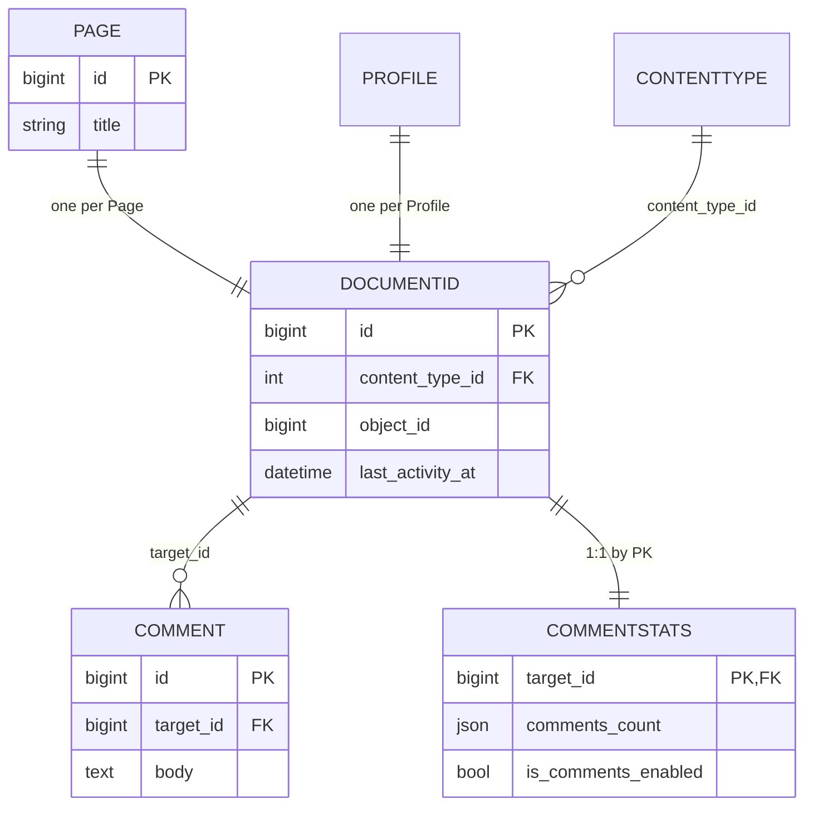

# Baseapp Core

This is the only required app in the baseapp-backend package. All other apps depend on it being installed and enabled in `INSTALLED_APPS`.

This app provides a set of shared features and extensible patterns, allowing the development of new apps and the maintenance of existing ones to focus only on their specific responsibilities.

## DocumentId Model

This is the most important model in the baseapp architecture. It acts as a database-level communication layer between models from different apps, helping reduce coupling across the system. In addition, it serves as a centralized model for registering the public IDs of all other models.

### How the decoupling works

Whenever we need to connect a model from one app to a model from another app, we create a generic foreign key pointing to the DocumentId model. Any model that should either allow other models to reference it or expose its ID to external apps such as the frontend must have a corresponding record in the DocumentId model. This ensures that the model is properly mapped and can participate in cross-app relationships.

Because this centralized model can grow to a large number of records, it is important to evaluate whether a model truly needs to be connected to DocumentId. In some cases, the model may already be reachable through existing foreign keys that are themselves mapped to DocumentId, making an additional mapping unnecessary.

Below is a database diagram illustrating the structure of the DocumentId model.

### Adapting your models

To connect your models to the DocumentId model, you simply need to extend the `baseapp_core.models.DocumentIdMixin` class in your model. This will automatically populate the corresponding DocumentId records via pgtriggers and will also provide a set of helper methods for internal use.

* `public_id`: Retrieves the public ID from the associated DocumentId record.
* `get_by_public_id`: Retrieves the corresponding model instance from a given public ID.

## HashIds

This feature introduces abstractions that allow projects to avoid exposing internal integer primary keys by using the DocumentId public_id as the unique identifier shared with external services, such as the frontend. Compared to sequential integer IDs, these public IDs make it significantly harder to infer other records, which is generally a safer and more appropriate approach than exposing raw database primary keys.

To make use of the HashIds feature, models, DRF endpoints, or Graphene operations must be made compatible by extending the required abstractions or by using the available helper functions.

For more details, see [Baseapp Core - HashIds](./hashids/README.md).