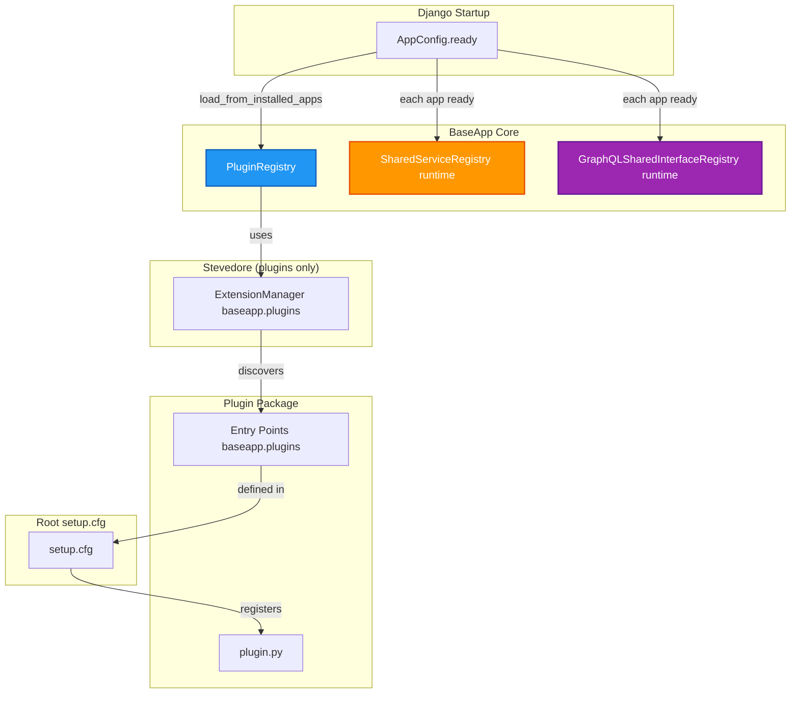
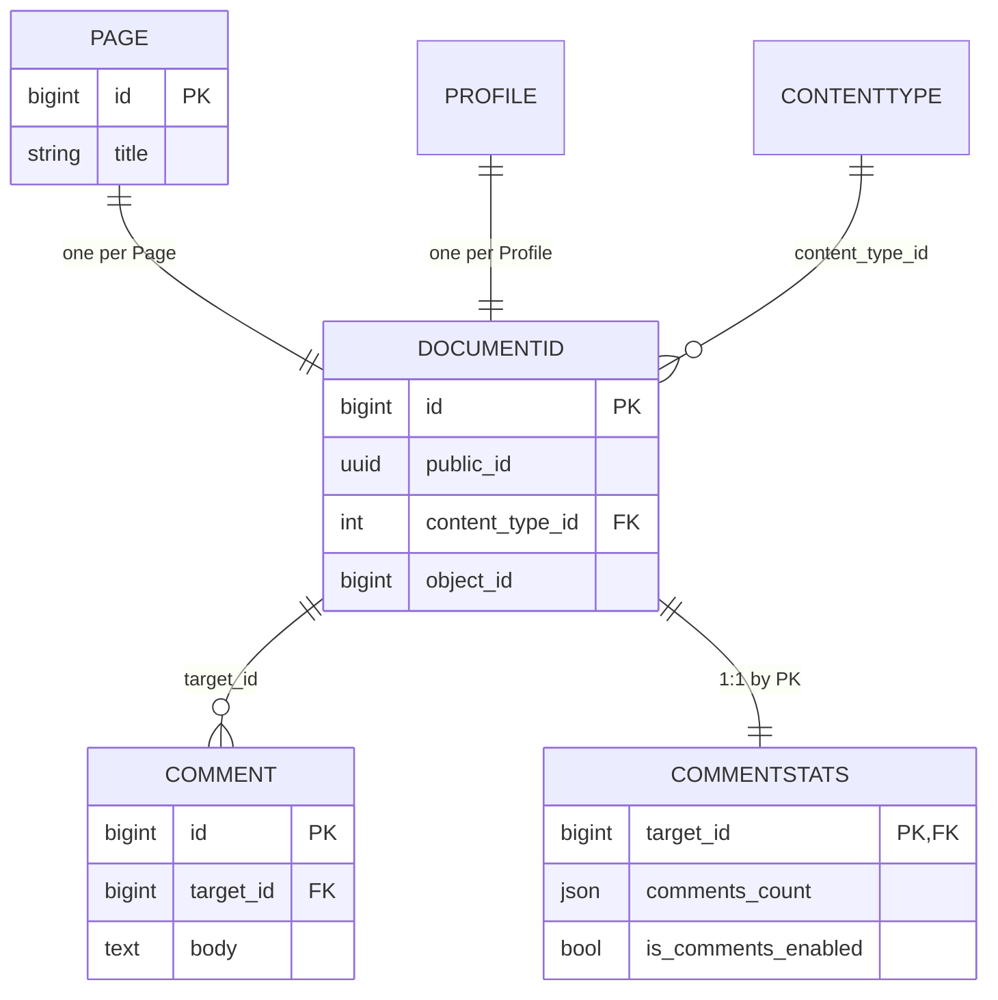

# BaseApp Plugin Architecture

## Table of Contents

1. [Overview](#overview)
2. [Creating a Plugin](#creating-a-plugin)
3. [Plugin Settings](#plugin-settings)
4. [Database: DocumentId Pattern](#database-documentid-pattern)
5. [Communication Patterns](#communication-patterns)
6. [Runtime Extension: BaseAppConfig](#runtime-extension-baseappconfig)
7. [Rebase Guide](#rebase-guide)
8. [Quick Reference](#quick-reference)

---

## Overview

BaseApp uses a **plugin-based architecture** for loose coupling between packages. Plugins are discovered via setuptools entry points **for static configuration only**. Runtime behavior (services, GraphQL, events) is **explicit and opt-in**, wired in `AppConfig.ready()`.

### Key Principles

- **Zero Direct Coupling**: Packages don't import from each other for runtime behavior
- **Plugin Discovery**: Via setuptools entry point `baseapp.plugins` (settings aggregation)
- **Runtime Wiring in ready()**: Services and GraphQL capabilities registered in `AppConfig.ready()`
- **Django-Native**: Cross-package events use **Django signals**
- **Database Decoupling**: Packages use `DocumentId` as a communication layer

### What Changed

- **Hooks** → **Django signals**
- **Services** → runtime registration via `AppConfig.ready()` (no entry points)
- **GraphQL Interfaces** → runtime registration via `AppConfig.ready()` as **GraphQL capabilities**

### Architecture Flow



---

## Creating a Plugin

### 1. Package Structure

```
baseapp_yourpackage/
    __init__.py
    apps.py          # BaseAppConfig + mixins; register in ready()
    plugin.py        # Plugin definition (settings only)
    models.py
    signals.py       # Optional: connect to Django signals
    services.py      # Optional: service provider classes
    graphql/
        interfaces.py  # Optional: capability getters
        object_types.py
        queries.py
        mutations.py
```

### 2. Register Entry Point in Root `setup.cfg`

All plugin entry points are registered in the **root `setup.cfg`** (not individual `setup.py` files):

```ini
[options.entry_points]
baseapp.plugins =
    baseapp_yourpackage = baseapp_yourpackage.plugin:YourPackagePlugin
```

### 3. Create `plugin.py`

```python
from baseapp_core.plugins.base import BaseAppPlugin, PackageSettings

class YourPackagePlugin(BaseAppPlugin):
    @property
    def name(self) -> str:
        return "baseapp_yourpackage"

    @property
    def package_name(self) -> str:
        return "baseapp_yourpackage"

    def get_settings(self) -> PackageSettings:
        return PackageSettings(
            INSTALLED_APPS=["baseapp_yourpackage"],
            MIDDLEWARE={"default": ["baseapp_yourpackage.middleware.YourMiddleware"]},
            AUTHENTICATION_BACKENDS={
                "baseapp_yourpackage": [
                    "baseapp_yourpackage.permissions.YourPackagePermissionsBackend",
                ],
            },
            GRAPHENE__MIDDLEWARE={"default": ["baseapp_yourpackage.graphql.middleware.YourMiddleware"]},
            django_extra_settings={
                "BASEAPP_YOURPACKAGE_SETTING": "value",
            },
            required_packages=[
                {"baseapp_core": "Core shared models and plugin infrastructure"},
            ],
            optional_packages=[
                {"baseapp_notifications": "Optional notifications integration"},
            ],
            graphql_queries=["baseapp_yourpackage.graphql.queries.YourPackageQueries"],
            graphql_mutations=["baseapp_yourpackage.graphql.mutations.YourPackageMutations"],
            graphql_subscriptions=[],
        )
```

### 4. Install Package

Add to `requirements.txt`:

```txt
-e ./baseapp_yourpackage
```

### 5. Add to `INSTALLED_APPS`

```python
INSTALLED_APPS = [
    # ... other apps
    "baseapp_yourpackage",
]
```

---

## Plugin Settings

The `PackageSettings` model defines what each plugin contributes. Only plugins whose app is in `INSTALLED_APPS` are loaded.

### PackageSettings Fields

| Category | Field (alias) | Type | Description |
|----------|---------------|------|-------------|
| List | `installed_apps` (`INSTALLED_APPS`) | `List[str]` | Apps to add; aggregated |
| Slotted | `authentication_backends` (`AUTHENTICATION_BACKENDS`) | `Dict[str, List[str]]` | Slot name → list of backend paths |
| Slotted | `middleware` (`MIDDLEWARE`) | `Dict[str, List[str]]` | Slot name → list of middleware paths |
| Slotted | `graphene_middleware` (`GRAPHENE__MIDDLEWARE`) | `Dict[str, List[str]]` | Slot name → list for `GRAPHENE["MIDDLEWARE"]` |
| Dict | `django_extra_settings` | `Dict[str, Any]` | Merged into Django settings |
| Dict | `celery_beat_schedules`, `celery_task_routes`, `constance_config` | `Dict` | Merged; last plugin wins on conflict |
| List | `urlpatterns`, `graphql_queries`, `graphql_mutations`, `graphql_subscriptions` | `List` | Aggregated |
| Deps | `required_packages`, `optional_packages` | `List[str \| Dict[str, str]]` | Validation only. Dict format is `{package_name: description}` |

**Slotted fields** use a dict: keys are slot names (e.g. `"auth"`, `"profile"`), values are lists. Use `get(key, slot)` to control order.

### Registry API

In `settings.py`, use **`get(key)`** for aggregated lists and **`get(key, slot)`** when order matters:

```python
INSTALLED_APPS += [
    *plugin_registry.get("INSTALLED_APPS"),
    "testproject.testapp",
]

MIDDLEWARE += [
    "baseapp_profiles.middleware.CurrentProfileMiddleware",
    *plugin_registry.get("MIDDLEWARE", "baseapp_auth"),
    *plugin_registry.get("MIDDLEWARE", "baseapp_profiles"),
]

AUTHENTICATION_BACKENDS = [
    "django.contrib.auth.backends.ModelBackend",
    *plugin_registry.get("AUTHENTICATION_BACKENDS", "baseapp_auth"),
    *plugin_registry.get("AUTHENTICATION_BACKENDS", "baseapp_profiles"),
]
```

**Supported keys:** `INSTALLED_APPS`, `MIDDLEWARE`, `AUTHENTICATION_BACKENDS`, `GRAPHENE__MIDDLEWARE`, `urlpatterns`, `graphql_queries`, `graphql_mutations`, `graphql_subscriptions`.

### URL Patterns

Plugins contribute URL patterns via **callbacks** in `plugin.py`:

```python
# plugin.py
def get_settings(self) -> PackageSettings:
    def v1_urlpatterns(include, path, re_path):
        return [
            re_path(r"auth/authtoken/", include("baseapp_auth.rest_framework.urls.auth_authtoken")),
        ]
    return PackageSettings(
        v1_urlpatterns=v1_urlpatterns,
        # ...
    )
```

**Project side:** Use registry getters in `urls.py`:

```python
from baseapp_core.plugins import plugin_registry

v1_urlpatterns = [
    *plugin_registry.get_all_v1_urlpatterns(),
]

urlpatterns = [
    path("admin/", admin.site.urls),
    path("v1/", include((v1_urlpatterns, "v1"), namespace="v1")),
    *plugin_registry.get_all_urlpatterns(),
]
```

### GraphQL Schema

Root `graphql.py` must **not** import Query/Mutation/Subscription mixins from BaseApp packages. Use registry getters:

```python
from baseapp_core.plugins import plugin_registry
from myproject.users.graphql.queries import UsersQueries  # project-specific only

queries = plugin_registry.get_all_graphql_queries()
mutations = plugin_registry.get_all_graphql_mutations()
subscriptions = plugin_registry.get_all_graphql_subscriptions()

class Query(graphene.ObjectType, UsersQueries, *queries):
    node = RelayNodeField(RelayNode)

class Mutation(graphene.ObjectType, *mutations):
    delete_node = DeleteNode.Field()

class Subscription(graphene.ObjectType, *subscriptions):
    pass

schema = graphene.Schema(query=Query, mutation=Mutation, subscription=Subscription)
```

Plugins contribute `graphql_queries`, `graphql_mutations`, `graphql_subscriptions` in `plugin.py`.

---

## Database: DocumentId Pattern

### The Problem

Direct foreign keys between models in different packages create tight coupling. Removing a package breaks migrations.

### The Solution

`DocumentId` is a central table providing a unique identifier for any object. Packages create **auxiliary tables** that reference `DocumentId` instead of each other's models.

### How It Works



### Creating DocumentId for Models

**Preferred:** Use `DocumentIdMixin` and pgtrigger:

```python
from baseapp_core.models import DocumentIdMixin

class Page(DocumentIdMixin, models.Model):
    # pgtrigger automatically creates DocumentId on insert
    ...
```

**Fallback:** Ensure `DocumentId` exists via `post_save` signal:

```python
DocumentId.get_or_create_for_object(instance)
```

### Creating Auxiliary Tables

Packages create tables that reference `DocumentId`:

```python
from baseapp_core.models import DocumentId

class CommentStats(models.Model):
    target = models.OneToOneField(
        DocumentId,
        on_delete=models.CASCADE,
        primary_key=True,
        related_name="comment_stats",
    )
    comments_count = models.JSONField(default=default_comments_count)
    is_comments_enabled = models.BooleanField(default=True)
```

### Benefits

- **Zero Direct Coupling**: Packages don't modify each other's models
- **Easy Removal**: Remove a package = remove its tables; no FKs from other packages
- **Flexible Relationships**: Any model with a `DocumentId` can have comments, reactions, etc.

---

## Communication Patterns

BaseApp provides three communication patterns:

| Need | Pattern | Use When |
|------|---------|----------|
| React to events | **Django signals** | Multiple packages need to respond to the same event |
| Provide/consume data | **Services** | Package needs to expose functionality to others |
| Extend GraphQL schema | **GraphQL capabilities** | Package needs to add fields/types to GraphQL |

### Django Signals

Cross-package events use **Django signals**. Connect receivers in `AppConfig.ready()`:

```python
# myapp/apps.py
from baseapp_core.signals import document_created

def _on_document_created(sender, document_id, **kwargs):
    # Create stats for the new document
    ...

class PackageConfig(BaseAppConfig):
    def ready(self):
        super().ready()
        document_created.connect(_on_document_created, dispatch_uid="my_app_on_document_created")
```

### Services

**Shared services** provide a runtime registry for packages to expose functionality to others without direct imports. Services are registered **at runtime** in `AppConfig.ready()`. No entry points.

**Provider:**

```python
# baseapp_comments/services.py
from baseapp_core.plugins import SharedServiceProvider

class CommentsCountService(SharedServiceProvider):
    @property
    def service_name(self) -> str:
        return "comments_count"

    def is_available(self) -> bool:
        return apps.is_installed("baseapp_comments")

    def get_count(self, document_id: int) -> dict:
        ...
```

**Register in apps.py:**

```python
from baseapp_core.plugins import BaseAppConfig, ServicesContributor

class PackageConfig(BaseAppConfig, ServicesContributor):
    def register_shared_services(self, registry):
        from .services import CommentsCountService
        registry.register("comments_count", CommentsCountService())
```

**Consumer:**

```python
from baseapp_core.plugins import shared_services

service = shared_services.get("comments_count")
if service:
    return service.get_count(document_id)
```

### GraphQL Capabilities

**GraphQL shared interfaces** are named, reusable interfaces that allow packages to extend GraphQL object types without direct imports. Providers register them in `AppConfig.ready()`; consumers opt in **by name**.

**Provider:**

```python
# baseapp_comments/apps.py
from baseapp_core.plugins import BaseAppConfig, GraphQLContributor
from baseapp_core.plugins import graphql_shared_interfaces

class PackageConfig(BaseAppConfig, GraphQLContributor):
    def register_graphql_shared_interfaces(self):
        from .graphql.object_types import CommentsInterface
        graphql_shared_interfaces.register("comments", CommentsInterface)
```

**Consumer (no cross-package imports):**

```python
from baseapp_core.plugins import graphql_shared_interfaces

def _get_page_interfaces():
    return graphql_shared_interfaces.get_interfaces(
        ["comments", "permissions"],  # By name only; no import
        [RelayNode, PageInterface],    # Default interfaces
    )

class PageObjectType(DjangoObjectType):
    class Meta:
        interfaces = _get_page_interfaces()
        model = Page
```

---

## Runtime Extension: BaseAppConfig

`baseapp_core` defines `BaseAppConfig` and two optional mixins:

- **BaseAppConfig**: Subclasses `django.apps.AppConfig`; calls mixin methods in `ready()`
- **ServicesContributor**: Implement `register_shared_services()` and register services
- **GraphQLContributor**: Implement `register_graphql_shared_interfaces()` and register capabilities

```python
class PackageConfig(BaseAppConfig, ServicesContributor, GraphQLContributor):
    def ready(self):
        super().ready()
        # Connect signals, etc.

    def register_shared_services(self, registry):
        registry.register("service_name", ServiceInstance())

    def register_graphql_shared_interfaces(self):
        graphql_shared_interfaces.register("interface_name", InterfaceClass)
```

---

## Rebase Guide

**No backward compatibility guarantee** when moving to this architecture. This section covers what breaks and how to adapt.

### Breaking Areas Summary

| Area | What breaks | How to adapt |
|------|-------------|--------------|
| **Database – migrations** | Plugin migrations removed; concrete models removed from plugins | Use **swapper** or **`db_table`** to keep existing table names |
| **Database – coupling** | Mixins like `CommentableModel` removed; replaced by `CommentStats` referencing `DocumentId` | Add **manual migrations**: remove columns, create DocumentId-based auxiliary tables, backfill |
| **Settings** | Settings driven by **plugin registry** | Replace with registry API (`plugin_registry.get(...)`) |
| **URLs** | URL patterns via **PackageSettings** callbacks | Replace hardcoded includes with `plugin_registry.get_all_urlpatterns()` |
| **GraphQL schema** | Queries/mutations via **PackageSettings** | Remove BaseApp imports; use registry getters |
| **Entry Points** | Registered in **root `setup.cfg`** | Move from `setup.py` to root `setup.cfg` |

### Database Migrations

**If you use swapper (recommended):**
- Your app already owns models and migrations. No change needed; ensure swapper settings still point to your app.

**If you don't use swapper:**
1. Create a local app with concrete models
2. Use `Meta.db_table` to keep existing table names:
   ```python
   class Page(AbstractPage):
       class Meta(AbstractPage.Meta):
           db_table = "baseapp_pages_page"  # existing table name
   ```
3. Your app's migrations are the single source of truth

### Database Decoupling

**What changes:**
- `CommentableModel` mixin removed (columns like `comments_count`, `is_comments_enabled`)
- `CommentStats` now keys off `DocumentId`, not the commentable model directly

**Manual migrations required:**
1. **Remove mixed-in columns**: Create migration to drop `comments_count`, `is_comments_enabled` from your models
2. **Ensure DocumentId exists**: Use `DocumentIdMixin` or `DocumentId.get_or_create_for_object(instance)`
3. **Adjust auxiliary tables**: `CommentStats` must have FK/OneToOne to `DocumentId.id` (not to Page/Profile)
4. **Backfill**: Use backfill command to create `DocumentId` for existing rows, then backfill `CommentStats`

### Settings Migration

**Short term:** Leave `settings.py` as-is (app will run, but may miss new plugin settings).

**Recommended:** Replace registry-handled settings with registry API:

```python
# Old
INSTALLED_APPS = ["baseapp_auth", "baseapp_profiles", ...]

# New
INSTALLED_APPS += [
    *plugin_registry.get("INSTALLED_APPS"),
]
```

### Coupled Points Checklist

- [ ] **Imports**: Remove cross-package runtime imports; use DocumentId/services instead
- [ ] **URLs**: Replace hardcoded BaseApp includes with `plugin_registry.get_all_urlpatterns()`
- [ ] **GraphQL**: Remove BaseApp Query/Mutation/Subscription imports; use registry getters
- [ ] **GraphQL interfaces**: Replace direct interface imports with `graphql_shared_interfaces.get_interfaces([...], default_interfaces)` by name
- [ ] **Swapper**: Keep settings correct; ensure auxiliary models match new schema (DocumentId-based)
- [ ] **Entry points**: Move from `setup.py` to root `setup.cfg`

---

## Quick Reference

- **Plugin registry**: Entry point `baseapp.plugins` in root `setup.cfg`
- **Registry API**: `plugin_registry.get("INSTALLED_APPS")`, `plugin_registry.get("MIDDLEWARE", "slot")`
- **URLs**: `plugin_registry.get_all_urlpatterns()`, `get_all_v1_urlpatterns()`
- **GraphQL**: `plugin_registry.get_all_graphql_queries()`, `get_all_graphql_mutations()`, `get_all_graphql_subscriptions()`
- **GraphQL interfaces**: `graphql_shared_interfaces.get_interfaces([...], default_interfaces)` by name
- **Services**: `shared_services.get("name")`
- **Signals**: Connect in `AppConfig.ready()`
- **DocumentId**: Use `DocumentIdMixin` or `DocumentId.get_or_create_for_object(obj)`
